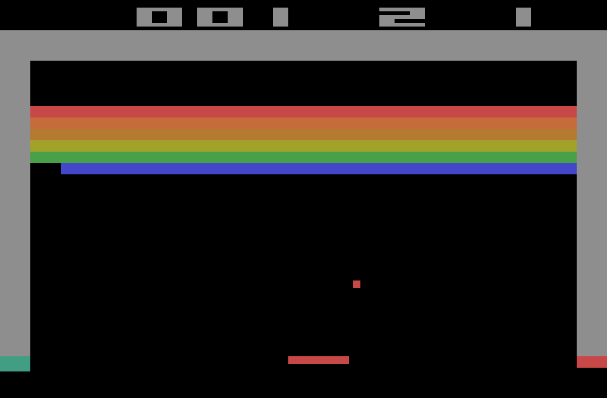

# Breakout

<p align="center">
  
</p>

<p align="center"><em>El Breakout del Atari 2600, rehecho en C al milimetro.</em></p>

---

## Como jugar

| Tecla        | Accion              |
|--------------|---------------------|
| Left / Right | Mover la pala       |
| Space        | Sacar la bola       |
| Enter        | Iniciar / Continuar |
| Escape       | Salir               |

Rompe las seis filas de ladrillos sin dejar caer la bola. Cada partida son tres bolas y dos pantallas completas. Si limpias las dos, ganas.

---

## Que trae

- Las 6 filas con los colores exactos del 2600 (rojo, naranja, ocre, oliva, verde, azul)
- Puntuacion fiel: rojo/naranja 7, amarillas 4, verde/azul 1 (432 puntos por pantalla, 864 el maximo)
- La bola acelera tras 4 golpes, tras 12, y al tocar las filas naranja y roja
- La pala se reduce a la mitad cuando rompes hasta el muro de arriba
- Dos pantallas de ladrillos por partida, como en la recreativa
- Marco gris y marcador con digitos de bloque calcados de la maquina original

Todo ajustable desde `include/config.h`.

---

## Como lo arranco

### Windows

```cmd
scripts\install-deps.bat
scripts\build.bat run
```

### macOS / Linux

```bash
scripts/install-deps.sh
scripts/build.sh run
```

### Crear una version portable

```cmd
scripts\dist.bat       :: Windows
```
```bash
scripts/dist.sh        # macOS / Linux
```

En Windows genera la carpeta `dist/` con el `.exe`, su DLL y los recursos: la comprimes y corre en cualquier Windows 10/11 sin instalar nada. En macOS/Linux Allegro es libreria del sistema, asi que `dist/` lleva solo el binario y los recursos (la maquina destino necesita Allegro 5 instalado).

---

## Que necesita

- GCC (o MinGW en Windows)
- Allegro 5.2+
- pkg-config (macOS/Linux)

Los scripts de instalacion se encargan de todo solos.

---

Hecho por [Edu Diaz (RGiskard7)](https://github.com/RGiskard7) — MIT License
